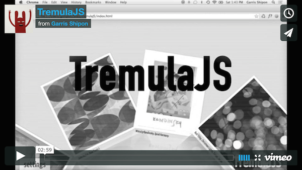

# TremulaJS

**Picture Streams + Momentum Engine + Bézier Paths + Cross-Browser + Cross-Device**  

TremulaJS is a client-side javascript UI component providing Bézier-based content-stream interactions with momentum & physics effects for mouse, scroll and and touch UIs. 

**Put another way, TremulaJS can be thought of as an extremely bad-ass image carousel.**  

**[Watch the TremulaJS video demo here](https://vimeo.com/99481197)**  

While there are some monumental physics-based JS animation frameworks out there -- most notably, [famo.us](http://famo.us), [gsap](http://greensock.com/gsap) and [velocity.js](http://velocityjs.org/) -- TremulaJS was built with a very specific end in mind: to enable the kind of long-running, low-friction user interactions one might enjoy when navigating large sets of visual data.

See TremulaJS in the wild: <a href="http://www.art.com/discover/keyword--gogh/posters.htm?searchstring=GOGH" title="TremulaJS on art.com" target="_blank">currently in production on Art.com</a>.

TremulaJS is compatible with all recent versions of iOS Safari, Chrome, OS X Safari, FF, IE.

TremulaJS was created by [Garris Shipon](http://garriss.wordpress.com/) at [Art.com Labs](http://art.com/).  

Licensed under GPLv3.

**follow [@garris](https://twitter.com/garris)**  

## More info...

- See [the demo video](https://vimeo.com/99481197) (2.5 min), illustrating some of the visual possibilities.  

- Play with the [live component demo](http://garris.github.com/TremulaJS)  

- Experiment with the configuration file on [CodePen](http://codepen.io/garris/pen/bevqG?editors=001)  

- Get up-and-running with the [fully-documented boilerplate file](https://gist.github.com/garris/2214de2100a4a67a2899), includes a summary of all configuration settings.  

- Download, Fork, Contribute on [GitHub](https://github.com/garris/TremulaJS.git)

- Learn how to <a href="http://davidwalsh.name/responsive-scalable-animations" title="Create your own TremulaJS grid projections" target="_blank">create your own Grid Projections</a> -- technical articles <del datetime="2014-09-17T19:09:40+00:00">coming soon</del> <a href="http://davidwalsh.name/responsive-scalable-animations" title="Create your own TremulaJS grid projections" target="_blank">here</a>!

**follow [@garris](https://twitter.com/garris)** 

  

### Installing

cd to the root of your project then...

     $ bower install tremulajs --save
    
Optional install for mocha test framework and local host server (this is just a convenience for testing on local phones and tablets.) 

cd to the tremulajs directory then...
    
    $ npm install

### Stepped scrolling (aka "paged" scrolling)
This feature will auto scroll the stream so that a single item is always presented in the center of the screen -- this is a cover-flow "like" behavior. 

To view the functionality, open the [demo here](http://garris.github.io/TremulaJS/) and call any of the following methods in the console...

    loadMountainPop()
    loadCarouselWithPop()
    loadHorizontalPop()

### Running the local test server

cd to the tremulajs directory then...

     $ node server.js
     
     
### Running mocha.js tests

with the test server running (or you can skip that part and use a browser with same origin policy disabled)

    $ open http://localhost:3000/test.html
     

### Building with r.js

cd to the tremulajs directory then...

    $ node r.js -o build.js; node r.js -o cssIn=src/Tremula.css out=dist/Tremula.css;node r.js -o build_min.js; node r.js -o cssIn=src/Tremula.css out=dist/Tremula.min.css optimizeCss=standard

### Dependencies

- HammerJS *(A most awesome touch event component)*
- JsBezier *(Thank you Simon Porritt !)*
- jQuery *(jQuery is a little overkill at this point -- It would be very straightforward to remove the few remaining convenience calls.  For now, still required. John Resig, I salute you!)*

### Tested in the following browsers
iOS Safari, Chrome, OS X Safari, FF, IE (recent versions) 
